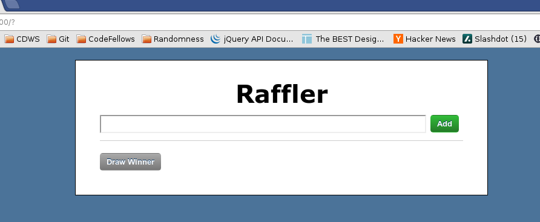
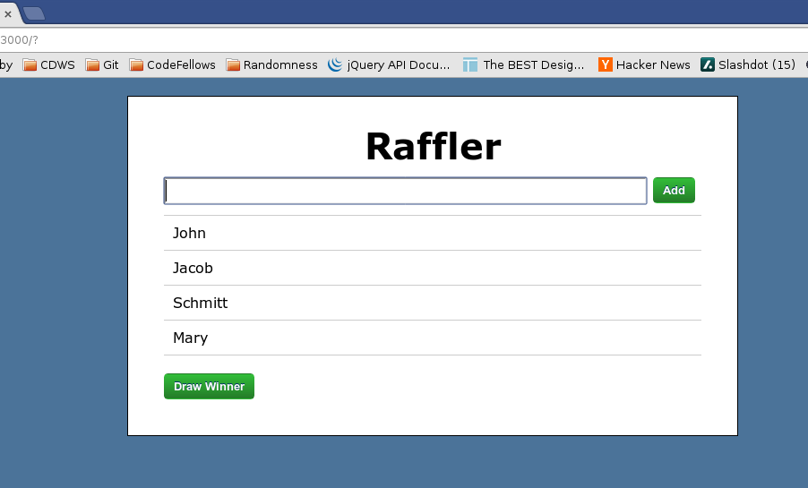
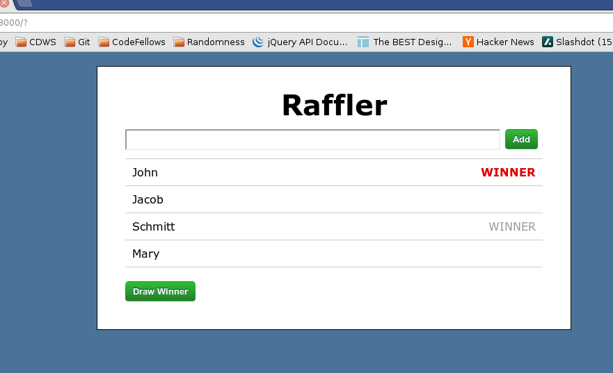

# Raffler

Implemented by [Danielle Tucker](http://www.linkedin.com/in/dqtucker/).

## Description
**Raffler** is a mini app developed by Ryan Bates in [Episode #408](http://railscasts.com/episodes/408-ember-part-1) and [Episode #410](http://railscasts.com/episodes/410-ember-part-2)

This app was designed to explore some of the abilities of the [Ember.js](http://emberjs.com/) framework within rails.

## Information

Screenshots of the application are below:

Main Screen...

Adding Raffle Tickets

Picking multiple winners

### Installation
This app does not require any special setup aside from cloning the app and then running:

`rake db:setup`

`rails s`

### Known Issues

If you discover any bugs, feel free to create an issue on GitHub fork and
send us a pull request.

### Contributing

1. Fork it
2. Create your feature branch (`git checkout -b my-new-feature`)
3. Commit your changes (`git commit -am 'Add some feature'`)
4. Push to the branch (`git push origin my-new-feature`)
5. Create new Pull Request

### License

Unknown...
